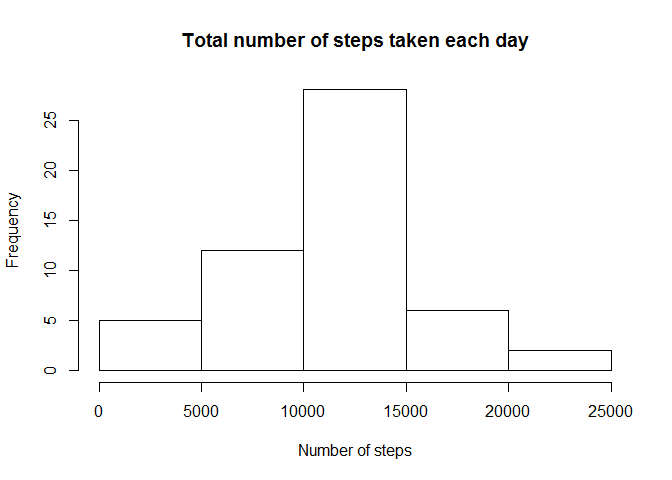
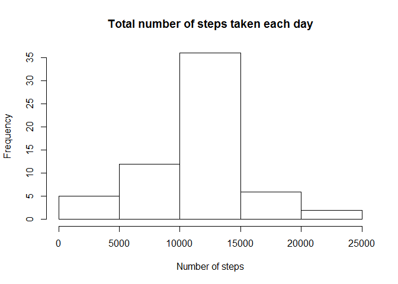

# Reproducible Research: Peer Assessment 1


## Loading and preprocessing the data

Load the data:

```r
unzip("activity.zip")
activity <- read.csv("activity.csv")
```


## What is mean total number of steps taken per day?

Aggregate the data as a sum of steps per day:


```r
stepsByDate <- aggregate(steps ~ date, data = activity, sum, na.rm = TRUE)
```

Histogram of the total number of steps taken each day:

```r
hist(stepsByDate$steps, main = "Total number of steps taken each day", xlab = "Number of steps")
```

 


# Calculate and report the mean and median total number of steps taken per day

Mean total number of steps per day:

```r
mean(stepsByDate$steps)
```

```
## [1] 10766.19
```

Median total number of steps per day:

```r
median(stepsByDate$steps)
```

```
## [1] 10765
```


## What is the average daily activity pattern?

Time series plot of the 5-minute interval (x-axis) and the average number of steps taken, averaged across all days (y-axis):

```r
stepsByInterval <- aggregate(steps ~ interval, data = activity, mean, na.rm = TRUE)
plot(stepsByInterval, type="l")
```

 

Which 5-minute interval, on average across all the days in the dataset, contains the maximum number of steps?

```r
paste(stepsByInterval[which.max(stepsByInterval$steps),]$interval, "th interval", sep = "")
```

```
## [1] "835th interval"
```

## Imputing missing values

Calculate and report the total number of missing values in the dataset: 


```r
paste (sum(is.na(activity)), "missing values.")
```

```
## [1] "2304 missing values."
```

Devise a strategy for filling in all of the missing values in the dataset. :

Will reuse the the mean for that 5-minute interval that we just calculated.

Create a new dataset that is equal to the original dataset but with the missing data filled in :


```r
naSteps <- is.na(activity[c("steps")])
activityFilled <- activity
# replace each missing step with the corresponding 5-min interval mean by matching on the intervals
activityFilled[naSteps,]$steps <- stepsByInterval[match(activity[naSteps,]$interval, stepsByInterval$interval),]$steps
```

Histogram of the total number of steps taken each day :


```r
stepsByDateFilled <- aggregate(steps ~ date, data = activityFilled, sum)
hist(stepsByDateFilled$steps, main = "Total number of steps taken each day", xlab = "Number of steps")
```

 

Calculate and report the mean and median total number of steps taken per day. 

Mean number of steps taken per day:

```r
mean(stepsByDateFilled$steps)
```

```
## [1] 10766.19
```

Median number of steps taken per day:

```r
median(stepsByDateFilled$steps)
```

```
## [1] 10766.19
```

Do these values differ from the estimates from the first part of the assignment? What is the impact of imputing missing data on the estimates of the total daily number of steps?

The mean is the same since we imputed missing data from the average. The median differs due to the placement of missing values.


## Are there differences in activity patterns between weekdays and weekends?

Create a new factor variable in the dataset with two levels ("weekday" and "weekend") indicating whether a given date is a weekday or weekend day using the dataset with the filled-in missing values :


```r
activityFilled$day <- weekdays(as.Date(activityFilled$date))
activityFilled[!activityFilled$day %in% c("Saturday","Sunday"),]$day <- "weekday"
activityFilled[activityFilled$day %in% c("Saturday","Sunday"),]$day <- "weekend"
```

Make a panel plot containing a time series plot of the 5-minute interval (x-axis) and the average number of steps taken, averaged across all weekday days or weekend days (y-axis) :


```r
library(lattice) 
stepsByIntervalFilled = aggregate(steps ~ interval + day, data = activityFilled, mean)
xyplot(steps ~ interval | day, data = stepsByIntervalFilled, layout = c(1, 2), type = "l")
```

 
